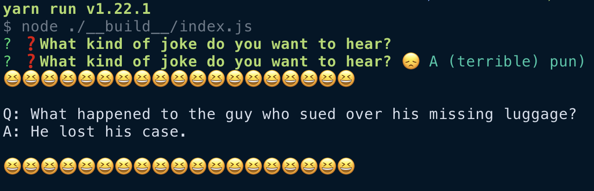

# Typescript, gRPC, and **Promises**

> A minimal command line app to serve as an example of how create a node
> **Typescript** project which uses **gRPC** with **Promises**



And it tells you a joke.

It's written in [Typescript](https://www.typescriptlang.org/) and spins up a
[gRPC](https://grpc.io/) server and client. It uses
[`grcp-tools`](https://github.com/grpc/grpc-node/tree/master/packages/grpc-tools)
to generate [`jspb`s](https://developers.google.com/protocol-buffers/docs/reference/javascript-generated),
which are Javascript implementations of Protocol Buffers.
It also uses the [`grpc-tools-node-protoc-promise-ts`](https://github.com/rhinodavid/grpc-tools-node-protoc-promise-ts)
plugin to generate Typescript definitions corresponding to the `jspb`s.

**One more thing**

The `jspb`s generated by `grcp-tools` use the old-school callback pattern. But since it's not
2010, this app uses [`grpc-promise-ts`](https://github.com/rhinodavid/grpc-promise-ts) to convert
the gRPC Client generated by `grpc-tools` to a client with an ES2015 Promise API.

## Installing and running

```bash
git clone https://github.com/rhinodavid/grpc-typescript-promise-example && \
cd grpc-typescript-promise-example && \
yarn && yarn build && yarn start
```

## How can I make an app like this?

A great place to start is the blog post [_gRPC with Node.js and TypeScript_](https://adnanahmed.info/blog/2019/11/01/grpc-with-nodejs-typescript/) by [@idnan](https://github.com/idnan). It's a fantastic introduction and a great place to get started,
but doesn't include a client implementation.

If you need details check out that post. Here I'll give you a broad overview of the steps used to build this app.

### 1. Create the proto

The [protocol buffer](https://developers.google.com/protocol-buffers) defines request and repsonse messages
between the client and the server, as well as what remote procedure calls will exist on the server. The
proto for the joke service is https://github.com/rhinodavid/grpc-typescript-promise-example/blob/master/src/proto/joke.proto.

### 2. Generate Javascript [jspb]s and Typescript definitions

The script to generate Javascript and Typescript definitions lives at
https://github.com/rhinodavid/grpc-typescript-promise-example/blob/master/scripts/generate_jspb.sh.
A portion of it is reproduced here:

```bash
PROTOC="./node_modules/.bin/grpc_tools_node_protoc"
NODE_PLUGIN="./node_modules/.bin/grpc_tools_node_protoc_plugin"
TYPESCRIPT_PLUGIN="./node_modules/.bin/grpc-tools-node-typescript-promise-plugin"

${PROTOC} \
  --js_out=import_style=commonjs,binary:"./${OUT_DIR}" \
  --plugin=protoc-gen-grpc="${NODE_PLUGIN}" \
  --grpc_out="./${OUT_DIR}" \
  --plugin=protoc-gen-tspromise="${TYPESCRIPT_PLUGIN}" \
  --tspromise_out=gen-promise-clients:"./${OUT_DIR}" \
  -I "${PROTO_DIR}" \
  "${PROTO_DIR}"/*.proto
```

This script is a little tricky, so lets break it down.

First we define paths to symlinked binaries/scripts in our `node_modules/.bin` folder.
`grpc_tools_node_protoc` and `grpc_tools_node_protoc_plugin` are installed by the `grpc-tools`
package.

`grpc_tools_node_protoc` is a Javascript wrapper around the C++ [`protoc`](https://github.com/protocolbuffers/protobuf) binary; it creates the `jspb`s. Its output is configured by the [`--js_out`](https://github.com/protocolbuffers/protobuf/tree/master/js#the---js_out-flag) argument. There's some mention in the docs of an es6 output, but that doesn't
appear to be implemented as of commit `c649397` in mid-2020, so you'll want to stick with `commonjs`.

`grpc_tools_node_protoc_plugin` also ships with `grpc-tools` and generates Javascript server and client stubs
for the `service`s specified in your protos.

`grpc-tools-node-typescript-promise-plugin` is installed by [`grpc-promise-ts`](https://github.com/rhinodavid/grpc-promise-ts)
and generates Typescript definitions for your messages and services.

**If you plan to use `grpc-promise-ts` to make promise clients for your services, include `gen-promise-clients`
in the output configuration argument of the plugin**

Now you're ready to run the script. Once it completes, you'll have two Javascript files and two `.d.ts`
definition files for each proto, a pair for the messages and a pair for the RPCs.

This project's files are in the [`jspb` folder](https://github.com/rhinodavid/grpc-typescript-promise-example/tree/master/jspb).
_Note: these generated files are commited to the repo for easy reference on Github, but I generally do not
include generated files in repositories for actual projects._

### 3. Create the server handler for the Joke service

Each service defined in your protos needs a handler. For each RPC in your service, the handler will have a function
which will take a request message and return a response message. Take a look at
[`server/jokeHandler.ts`](https://github.com/rhinodavid/grpc-typescript-promise-example/blob/master/src/server/jokeHandler.ts)
for an example.

### 4. Create the server

The server implementation is at
[`server/server.ts`](https://github.com/rhinodavid/grpc-typescript-promise-example/blob/master/src/server/server.ts).
For each service you'd like the server to provide, you call `server.addService(<service>, <handler>)` to add it
to the server. Then bind the server to a host/port and start it.

### 5. Create the client

The client gets created by a helper function in [`client/createJokePromise.ts`](https://github.com/rhinodavid/grpc-typescript-promise-example/blob/master/src/client/createJokePromise.ts).
To create the callback client use `new JokeClient("<host>:<port>", credentials.createInsecure())` (when you eventually
add authentication to your server this will take a bit more configuration).

**PROMISIFY IT**

We use `convertToPromiseClient` from `grpc-promise-ts` to create a client with a promise API (make sure you
included `gen-promise-clients` in your proto build script):

```typescript
const promiseClient = convertToPromiseClient(callbackClient);
```

Now we can await reponses to the RPCs!

#### Using the promise client

For unary RPCs the signature is:

```typescript
(request: TRequest, metadata?: Metadata, options?: Partial<CallOptions>) => TUnaryResult<TResponse>;
```

Let's look at `TUnaryResult`. Its signature is:

```typescript
interface TUnaryResult<TResponse> extends Promise<TResponse> {
  getUnaryCall: () => grpc.ClientUnaryCall;
}
```

Since it extends `Promise` we can `await` its result like any other `Promise`.
So getting a response looks like

```typescript
const response = await promiseClient.getJoke(jokeRequest);
```

If you need access to the
[`grpc.ClientUnaryCall`](https://github.com/grpc/grpc-node/blob/master/packages/grpc-native-core/index.d.ts#L1274)
you can remove the `await` and call `getUnaryCall` on the result:

```typescript
const result = promiseClient.getJoke(jokeRequest);
const unaryCall = result.getUnaryCall();
try {
  const response = await result;
} catch (e) {
  console.error(`Promise rejected: ${e}`);
}
unaryCall.cancel(); // promise will reject if it was still pending
```

### 6. Putting it together

The joke CLI is implemented in [`app.ts`](https://github.com/rhinodavid/grpc-typescript-promise-example/blob/master/src/app.ts).

_Most real apps won't have the client and server in the same app_

The logic steps the app are:

- Get a free port
- Start the server
- Start the client
- Use [Inquirer](https://github.com/SBoudrias/Inquirer.js) to ask the user what kind of joke they want
- Build a request proto with that choice
- Send the request via the client to the server and awaits the response
- Show the response text to the user
- Shut down the client
- Shut down the server

Don't forget to shutdown your client, otherwise your node process will not exit
(servers generally don't shut down).
